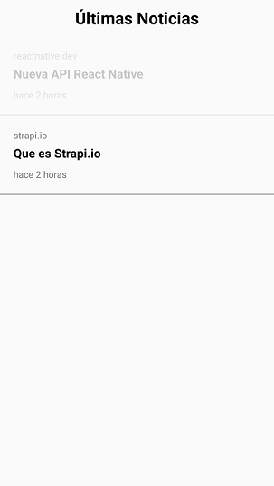
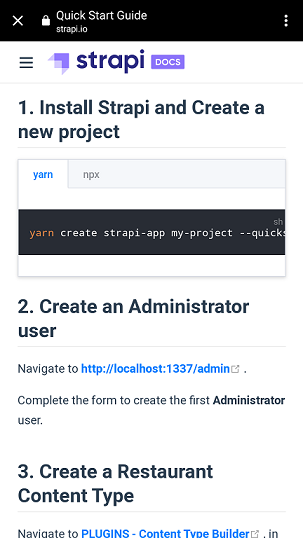

# Desarrollo de una API (strapi) y APP de Noticias


 

 


## Crear Strapi Api-Rest

```
npx create-strapi-app strapi_rest --quickstart

Available commands in your project:

  yarn develop
  Start Strapi in watch mode.

  yarn start
  Start Strapi without watch mode.

  yarn build
  Build Strapi admin panel.

  yarn strapi
  Display all available commands.

You can start by doing:

  cd C:\Users\guill\Desktop\news_app\strapi_rest
  yarn develop

  http://localhost:1337/admin

```

## Crear App y Dependencias

```
npx react-native init news

yarn add lodash
yarn add moment
yarn add url-parse
yarn add react-native-inappbrowser-reborn
```

## Determinar IP en Win

```
ipconfig
```